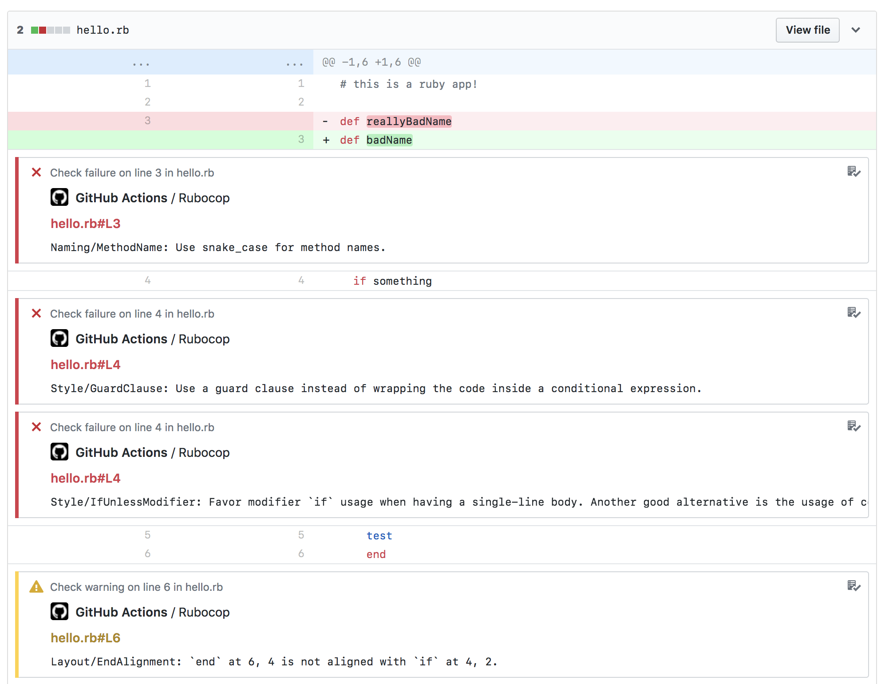

# Bundled Rubocop Codestyle Action

Lint your Ruby code in parallel to your builds with annotations. Runs as a composite action using your installed and configured ruby runtime.




## Setup
```yml
# .github/workflows/ruby_codestyle.yml

name: Ruby Codestyle

on: [pull_request]

jobs:

  lint:

    runs-on: ubuntu-latest

    steps:
    ### START SUGGESTED SETUP
    - uses: actions/checkout@v2

    - uses: actions/cache@v2
      with:
        path: vendor/bundle
        key: ${{ runner.os }}-gems-${{ hashFiles('**/Gemfile.lock') }}
        restore-keys: |
          ${{ runner.os }}-gems-

    - name: Set up Ruby
      uses: ruby/setup-ruby@v1
      with:
        ruby-version: 2.6 # MATCH YOUR RUBY VERSION?

    - name: Bundle install
      run: |
        bundle config path vendor/bundle
        bundle install --jobs 4 --retry 3

    ### END SUGGESTED SETUP

    - name: Rubocop checks
      uses: danielwestendorf/bundled-rubocop-codestyle-action@v1
      env:
        GITHUB_TOKEN: ${{ secrets.GITHUB_TOKEN }} # For annotations

```

Credit: gimenete/rubocop-action
